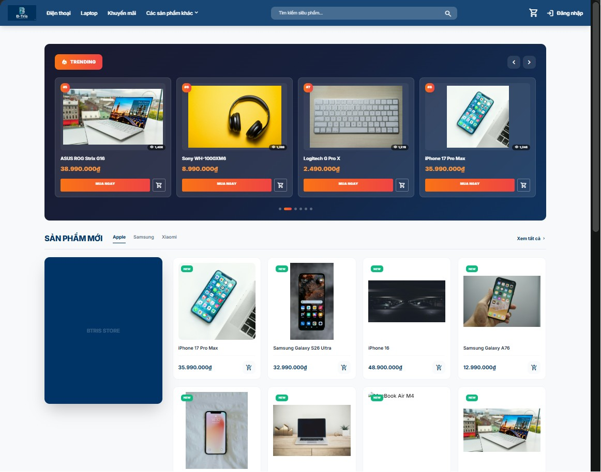
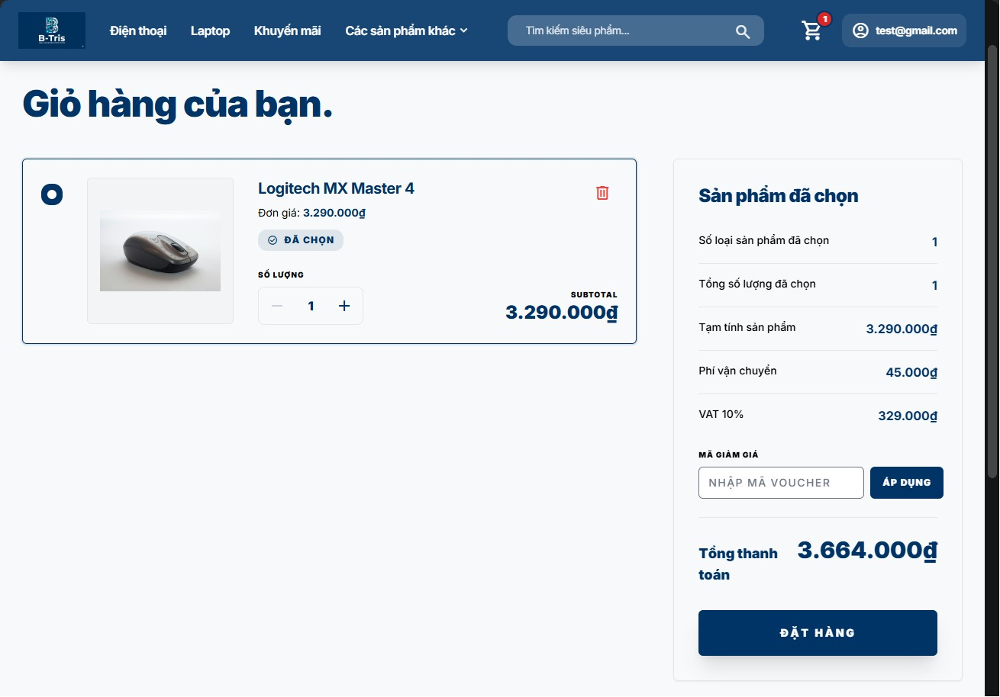
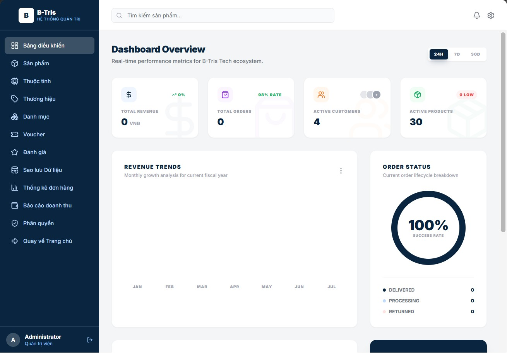

# 🛍️ Đồ Án Lập Trình Web Backend - Nhóm I (DoAn-BE2-NhomI)

Chào mừng bạn đến với **Hệ Thống Website Thương Mại Điện Tử** - đồ án môn học được xây dựng hoàn chỉnh trên nền tảng **Laravel 11** và **PHP 8.2**. Dự án tích hợp đầy đủ các tính năng của một website bán hàng hiện đại từ quản lý sản phẩm, giỏ hàng, khuyến mãi, cho đến thanh toán trực tuyến và quản trị thông minh.

---

## 📸 Giao Diện Dự Án

Dưới đây là một số hình ảnh thực tế từ giao diện hệ thống:

### 🏠 Trang Chủ (Client)
Giao diện mua sắm trực quan, thân thiện với người dùng, tích hợp tìm kiếm nhanh AJAX và bộ lọc thông minh.


### 🛒 Giỏ Hàng & Thanh Toán
Quản lý sản phẩm trong giỏ, áp dụng mã giảm giá (Voucher) và hỗ trợ nhiều phương thức thanh toán trực tuyến.


### 📊 Trang Quản Trị (Admin Dashboard)
Hệ thống quản lý trực quan dành cho admin với đầy đủ thống kê doanh thu, quản lý danh mục, đơn hàng và phân quyền.


---

## 🛠️ Công Nghệ Sử Dụng

Dự án được xây dựng với những công nghệ và thư viện hiện đại nhất trong hệ sinh thái PHP/Laravel:

*   **Core Framework**: Laravel 11.x & PHP 8.2+
*   **Database**: MySQL
*   **Frontend Integration**: Blade Template, Tailwind CSS, Vite
*   **Thư viện tích hợp nổi bật**:
    *   `laravel/socialite`: Hỗ trợ đăng nhập nhanh bằng tài khoản Google và GitHub.
    *   `barryvdh/laravel-dompdf`: Xuất hóa đơn chuyên nghiệp định dạng PDF.
    *   `spatie/laravel-backup`: Sao lưu dữ liệu tự động và khôi phục hệ thống linh hoạt.
*   **Cổng thanh toán**: Tích hợp trực tiếp ví điện tử **MoMo** và cổng thanh toán **VNPay** (kèm Mock Portal tiện dụng cho môi trường thử nghiệm).

---

## ✨ Các Tính Năng Chính

### 👤 Dành Cho Khách Hàng (Client-side)
1.  **Xác Thực & Bảo Mật**:
    *   Đăng ký & Đăng nhập truyền thống kèm cơ chế **xác thực mã OTP** qua email.
    *   Đăng nhập nhanh qua **Google** hoặc **GitHub** bằng OAuth2.
2.  **Trải Nghiệm Mua Sắm**:
    *   Tìm kiếm nhanh AJAX không cần tải lại trang.
    *   Bộ lọc và phân loại sản phẩm theo danh mục và thương hiệu.
    *   Tính năng **So sánh sản phẩm** trực quan để đưa ra quyết định mua hàng tốt nhất.
3.  **Quản Lý Đơn Hàng & Giỏ Hàng**:
    *   Giỏ hàng động: thêm, sửa số lượng, xóa và áp dụng **Voucher giảm giá**.
    *   Quản lý sổ địa chỉ giao hàng linh hoạt (thiết lập địa chỉ mặc định).
    *   Đặt hàng và thanh toán an toàn qua cổng **MoMo** hoặc **VNPay** (tự động tính phí vận chuyển bằng AJAX).
    *   Xem lịch sử mua hàng, hủy đơn, đặt lại đơn cũ (Reorder) nhanh chóng và xuất hóa đơn định dạng PDF.
4.  **Đánh Giá Sản phẩm**: Gửi nhận xét, đánh giá sản phẩm đã mua kèm theo số sao.

### 🛡️ Dành Cho Quản Trị Viên (Admin-side)
1.  **Thống Kê & Báo Cáo**:
    *   Trang Dashboard thống kê tổng quan doanh thu, số lượng đơn hàng, khách hàng mới.
    *   Báo cáo doanh thu chi tiết theo thời gian thực.
2.  **Quản Lý Dữ Liệu**:
    *   Quản lý toàn diện Sản phẩm (thêm, sửa, xóa, quản lý thuộc tính).
    *   Quản lý Danh mục, Thương hiệu và các chiến dịch mã giảm giá (Vouchers).
    *   Kiểm duyệt đánh giá (Review) từ khách hàng trước khi hiển thị công khai.
3.  **Hệ Thống & Bảo Mật**:
    *   **Phân quyền (Roles & Permissions)**: Phân chia quyền hạn chi tiết cho từng tài khoản quản trị viên.
    *   **Quản lý Sao lưu (Backup)**: Tạo file backup database/source code, tải xuống, khôi phục hệ thống hoặc xóa các bản sao lưu cũ trực tiếp từ trang Admin.

---

## 🚀 Hướng Dẫn Cài Đặt

Thực hiện các bước sau để thiết lập dự án trên môi trường cục bộ (Local Development):

### 1. Di chuyển vào thư mục dự án chính
```bash
cd DoAn-BE2-NhomI
```

### 2. Cài đặt các thư viện phụ thuộc
Cài đặt dependencies cho cả Backend (Composer) và Frontend (NPM):
```bash
composer install
npm install
```

### 3. Cấu hình môi trường `.env`
Sao chép cấu hình từ file ví dụ:
```bash
cp .env.example .env
```
Mở file `.env` mới tạo và thiết lập các thông số cấu hình:
*   Kết nối Database (`DB_DATABASE`, `DB_USERNAME`, `DB_PASSWORD`).
*   Cấu hình gửi mail OTP (`MAIL_MAILER`, `MAIL_HOST`, `MAIL_PORT`, `MAIL_USERNAME`, `MAIL_PASSWORD`, `MAIL_FROM_ADDRESS`).
*   Cấu hình Socialite (Google & GitHub Client ID/Secret) nếu muốn sử dụng Đăng nhập mạng xã hội.
*   Cấu hình cổng thanh toán MoMo và VNPay.

Sau đó, tạo Application Key:
```bash
php artisan key:generate
```

### 4. Migrate và Seed dữ liệu mẫu
Tạo các bảng trong Database và nạp dữ liệu demo ban đầu:
```bash
php artisan migrate --seed
```

### 5. Khởi chạy dự án ở chế độ phát triển
Chạy lệnh sau để khởi động đồng thời local server, queue listener phục vụ gửi OTP, và Vite compiler:
```bash
composer dev
```
Truy cập ứng dụng tại: `http://localhost:8000`
